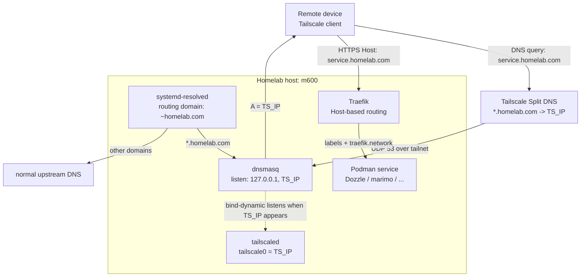
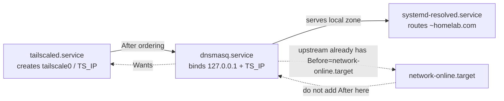
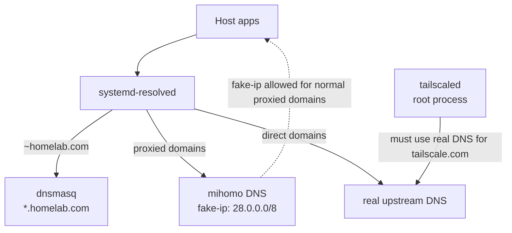

# Tailscale 远程访问配置

通过 Tailscale Split DNS，从任意 tailnet 设备使用**相同域名**访问 homelab 服务。

## 架构

以 Dozzle 为例，本地和远程使用相同 URL（`https://dozzle.homelab.com`）：



本机访问路径：`systemd-resolved -> dnsmasq(127.0.0.1) -> Traefik`。

远程访问路径：`Tailscale Split DNS -> dnsmasq(TS_IP) -> Traefik`。

## 前置条件

- **已完成 [traefik.md](traefik.md) 的 Linux DNS 配置**（NetworkManager + systemd-resolved + dnsmasq）
- Tailscale 已安装并登录 (`tailscale status`)
- [Tailscale Admin Console](https://login.tailscale.com/admin) 访问权限
- sudo 权限

## 配置步骤

### 1. 启动 Tailscale 并添加标签

在 [Tailscale ACL](https://login.tailscale.com/admin/acls) 中使用最小可用示例（只允许成员访问 homelab server）：

```json
{
  "tagOwners": {
    "tag:homelab": ["autogroup:admin"]
  },
  "grants": [
    {
      "src": ["autogroup:member"],
      "dst": ["tag:homelab"],
      "ip": ["*"]
    }
  ]
}
```

然后启动 Tailscale 并获取 IP：

```bash
sudo tailscale up --accept-dns=false --advertise-tags=tag:homelab
TS_IP=$(tailscale ip -4)
echo "Tailscale IP: $TS_IP"
# 输出示例: 100.94.150.93
```

后续步骤都使用 `$TS_IP` 变量。

如果多次修改配置不确定当前状态，可先重置再重新执行：

```bash
sudo tailscale up --reset
sudo tailscale up --accept-dns=false --advertise-tags=tag:homelab
```

### 2. 扩展 dnsmasq 监听 Tailscale IP

在 [traefik.md](traefik.md) 的基础配置上，让 dnsmasq 额外监听 Tailscale IP，并返回 `$TS_IP`（而非 127.0.0.1）：

```bash
# 更新 dnsmasq 配置（只用 listen-address，不要加 interface=tailscale0）
sudo tee /etc/dnsmasq.d/homelab.conf > /dev/null << EOF
listen-address=127.0.0.1,${TS_IP}
bind-dynamic
address=/.homelab.com/${TS_IP}
EOF

# 让 dnsmasq 优先排在 tailscaled 之后启动；bind-dynamic 负责处理地址稍后出现的情况
sudo install -d /etc/systemd/system/dnsmasq.service.d
sudo tee /etc/systemd/system/dnsmasq.service.d/override.conf > /dev/null << 'EOF'
[Unit]
After=tailscaled.service
Wants=tailscaled.service
EOF

sudo systemctl daemon-reload
sudo systemctl restart dnsmasq
```

> [!NOTE]
> `After=tailscaled.service` 只提供 systemd 启动排序，不保证 `${TS_IP}` 已经分配完成；因此这里用 `bind-dynamic`，允许 Tailscale 地址稍后出现时再被 dnsmasq 监听。不能加 `network-online.target`：上游 `dnsmasq.service` 已经 `Before=network-online.target`，本地 override 再写 `After=network-online.target` 会形成 systemd ordering cycle，导致 dnsmasq 无法启动。这里用 `Wants`（而非 `Requires`），这样 tailscaled 重启时不会连带停止 dnsmasq，本机 DNS 解析不受影响。

#### systemd 启动依赖边界



`dnsmasq` 需要尽量排在 `tailscaled` 后启动，但不能把 `After=` 理解为“地址已 ready”。`bind-dynamic` 承担动态地址监听；`Wants=tailscaled.service` 比 `Requires=` 更温和：tailscaled 重启或短暂不可用时，不会强制把本机 DNS 服务一并拉停。

> [!TIP]
> `/etc/dnsmasq.d/*.conf` 可能默认未启用，需要在 `/etc/dnsmasq.conf` 里开启 `conf-dir`。

### 3. 配置 Tailscale Split DNS（Admin Console）

1. 打开 [Tailscale Admin Console](https://login.tailscale.com/admin/dns)
2. 进入 **DNS** 页面
3. 在 **Nameservers** → **Add nameserver** → **Custom**
4. 添加 Split DNS 配置：
   - **Nameserver**: homelab server 的 `$TS_IP`
   - **Restrict to domain**: `homelab.com`
5. 保存

> [!NOTE]
> 配置后，tailnet 内所有设备查询 `*.homelab.com` 时会自动转发到 homelab server 的 dnsmasq。

### 附录：FlClash 与 Tailscale 共存

Android 上同时使用 FlClash 和 Tailscale 时，在 FlClash 中配置域名服务器策略：

**工具** → **基本配置** → **DNS** → **域名服务器策略** → 新建：

- 域名：`+.homelab.com`
- 服务器：`<TS_IP>`（如 `100.94.150.93`）

### 附录：Linux mihomo（Clash.Meta）与 Tailscale 共存

Linux 上若启用 mihomo TUN + `enhanced-mode: fake-ip`，**必须**把 Tailscale 相关后缀同时加入 DNS 旁路与直连规则。只做直连规则不够：域名仍会分到 fake-ip（`28.0.0.0/8`），而 `tailscaled` 以 root 运行、不在 mihomo 的 per-uid 隧道里，会表现为 `NoState` / `controlplane.tailscale.com` register `context deadline exceeded`。

#### 共存拓扑



关键取舍：

- `mihomo` 可以给普通代理域名返回 fake-ip，但 Tailscale 控制面域名必须走真实解析和直连。
- `dnsmasq` 只负责 `*.homelab.com` 权威解析，不替代 mihomo 的代理 DNS，也不替代系统默认 DNS。
- `systemd-resolved` 负责宿主机的 routing domain；Podman 自定义 bridge 的容器 DNS 规则见 [quadlet.md](quadlet.md#网络架构)。

本仓库不管理 mihomo，只记录 Tailscale 控制面需要真实 DNS 与直连这一边界。mihomo 侧的必要 pattern：

```yaml
dns:
  enhanced-mode: fake-ip
  fake-ip-range: 28.0.0.1/8
  fake-ip-filter:
    - +.tailscale.com
    - +.tailscale.io

rules:
  - DOMAIN-SUFFIX,tailscale.com,直连,no-resolve
  - DOMAIN-SUFFIX,tailscale.io,直连,no-resolve
```

> [!IMPORTANT]
> 两层都要：
>
> 1. `fake-ip-filter`：DNS 不返回 `28.x` fake-ip
> 2. `DOMAIN-SUFFIX,...,直连`：流量不进代理
>
> 不要用 `hosts:` 写死 controlplane IP；filter 只是“走真实解析”，不是静态 hosts。

修改后重启或重载 mihomo，并清空 fake-ip 缓存。验证：

```bash
# 应返回非 28.x（真实解析；若上游污染可能是 192.200.0.x，仍不是 fake-ip）
dig @127.0.0.1 -p 1053 controlplane.tailscale.com +short
dig @127.0.0.1 -p 1053 derp.tailscale.com +short

# 对照：普通被代理域名仍应是 fake-ip
dig @127.0.0.1 -p 1053 www.google.com +short

# Tailscale 应 Running，且 peer 可达
tailscale status
```

> [!NOTE]
> mihomo **不**替代本机 dnsmasq。`*.homelab.com` 权威解析与 tailnet Split DNS（`TS_IP:53`）仍由 dnsmasq 负责；mihomo 只处理代理 DNS / 分流。

> [!NOTE]
> Traefik 仍是 homelab 服务的统一入口。Tailscale/mihomo 只改变宿主机的解析与出站路径；`traefik.network` 的 Podman 自定义 bridge DNS 配置和外部解析排障统一见 [quadlet.md](quadlet.md#网络架构)。

### 附录：修复 Tailscale UDP GRO warning

```bash
sudo tee /etc/NetworkManager/dispatcher.d/50-tailscale-gro > /dev/null << 'EOF'
#!/bin/bash
[[ "$1" == "enp1s0" && "$2" == "up" ]] && ethtool -K enp1s0 rx-udp-gro-forwarding on rx-gro-list off
EOF

sudo chmod +x /etc/NetworkManager/dispatcher.d/50-tailscale-gro
```

## 验证

### 本机验证

```bash
# DNS 解析
dig dozzle.homelab.com +short
# 应返回: $TS_IP

# HTTP 访问
curl -k https://dozzle.homelab.com
```

### 远程设备验证（手机/其他电脑）

确保设备已连接 Tailscale，然后：

```bash
# DNS 解析（指定 nameserver 测试）
dig @$TS_IP dozzle.homelab.com +short
# 应返回: $TS_IP

# 浏览器访问
# https://dozzle.homelab.com
```

## 故障排除

### dnsmasq 未运行

```bash
# 检查监听端口
ss -u -lpn | rg ':53'
# 应看到 127.0.0.1:53 和 ${TS_IP}:53

# 检查配置语法
cat /etc/dnsmasq.d/homelab.conf

# 重启 dnsmasq
sudo systemctl restart dnsmasq
```

### 远程设备 DNS 解析失败

```bash
# 检查 Tailscale 连接
tailscale status

# 手动测试 DNS
dig @$TS_IP dozzle.homelab.com
```

### Split DNS 未生效

1. 确认 Tailscale Admin Console 配置已保存
2. 在客户端重启 Tailscale：
   - macOS/Windows: 退出并重新打开 Tailscale
   - Linux: `sudo systemctl restart tailscaled`
   - Android/iOS: 断开并重新连接

### 本机解析慢 / 首次查询延迟

```bash
resolvectl status
resolvectl query dozzle.homelab.com
```

- `Global DNS Servers` 不应是 `127.0.0.1`
- `Global` 应保留 `DNS Servers: 127.0.0.1` 和 `DNS Domain: ~homelab.com`；本方案不要求启用 Tailscale MagicDNS

## 安全注意事项

1. **限制 DNS 递归**：当前 dnsmasq 只服务 `homelab.com` zone，不做通用递归解析
2. **Tailscale ACL**：可在 Admin Console 限制哪些设备能访问 homelab server 的 DNS 端口

## 参考

> [!IMPORTANT]
> 修改本文档前，先查阅以下官方链接验证配置是否过时。

- [Tailscale Split DNS](https://tailscale.com/kb/1054/dns)
- [Split DNS Policies](https://tailscale.com/kb/1588/split-dns-policies)
- [MagicDNS](https://tailscale.com/kb/1081/magicdns)
- [tailscaled(8)](https://man.archlinux.org/man/tailscaled.8.en)
- [NetworkManager-dispatcher(8)](https://man.archlinux.org/man/NetworkManager-dispatcher.8.en)
- [dnsmasq(8)](https://man.archlinux.org/man/dnsmasq.8.en)
- [mihomo DNS / fake-ip](https://wiki.metacubex.one/config/dns/)
